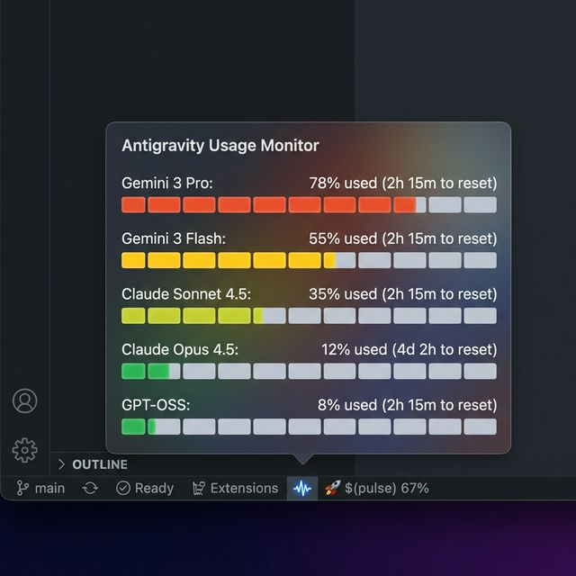

# Antigravity Usage Monitor

**Antigravity Usage Monitor** is a powerful VS Code extension for the **Google Antigravity IDE** that gives you real-time visibility into your AI model quotas, usage limits, and reset times.

Stop guessing when your `Claude Opus` or `Gemini Pro` credits will reset. Get precise, persistent monitoring directly in your status bar.

## ✨ Features

- **🚀 Real-Time Status Bar**: Always-on display of your overall quota health.
  - 🟢 **Healthy (<70%)**: Business as usual.
  - 🟡 **Warning (70-90%)**: Keep an eye on your usage.
  - 🔴 **Critical (>90%)**: Slow down or switch models.

- **📊 Comprehensive Dashboard**: Click the status bar item to open a detailed webview:
  - **Per-Model Breakdown**: See usage charts for every model (Gemini, Claude, GPT-OSS).
  - **Reset Countdowns**: Precise timers showing exactly when each model's quota will refresh.
  - **Prompt Credits**: Track your monthly shared credit pool effortlessly.
  - **Live/Mock Toggle**: Switch between live data and mock data for testing.

- **🔔 Smart Notifications**:
  - Get desktop alerts when specific models hit 70% (Warning) or 90% (Critical) usage.
  - Never get caught off-guard by a sudden rate limit.

- **🔒 Privacy First**:
  - **Zero Data Collection**: All data is read locally from your Antigravity instance.
  - **Local Communication**: Communicates only with `localhost`; no external API calls.

## 🛠️ Configuration

Customize the extension to fit your workflow in **Settings** (`Cmd+,`):

| Setting | Default | Description |
|:--------|:-------:|:------------|
| `antigravity-usage.pollingInterval` | `30` | How often (in seconds) to check for quota updates. |
| `antigravity-usage.warningThreshold` | `70` | Usage % that triggers a 🟡 status and notification. |
| `antigravity-usage.criticalThreshold` | `90` | Usage % that triggers a 🔴 status and notification. |
| `antigravity-usage.enableNotifications` | `true` | Enable/disable desktop popup notifications. |
| `antigravity-usage.enableMockData` | `false` | Enable to preview the dashboard with sample data. |

## 🚀 Getting Started

1. **Install** the extension from the marketplace or VSIX.
2. Ensure **Google Antigravity** is running.
3. Look for the **AG** percentage indicator in your VS Code status bar (bottom right).
4. **Click** the indicator to open the full dashboard.

## 🔧 Troubleshooting

- **"No Antigravity Instance Detected"**:
  - Ensure the Antigravity IDE application is running.
  - The extension relies on finding the local Language Server process.

- **Data not updating**:
  - Try interacting with the AI (ask a question) to force a state refresh in the webview.
  - Run the `Antigravity: Refresh Quota` command from the Command Palette.

## 🤝 Contributing

We welcome contributions! Please see the [GitHub Repository](https://github.com/tuckiestudio/antigravity-usage-monitor) for more details.

## 📄 License

MIT
